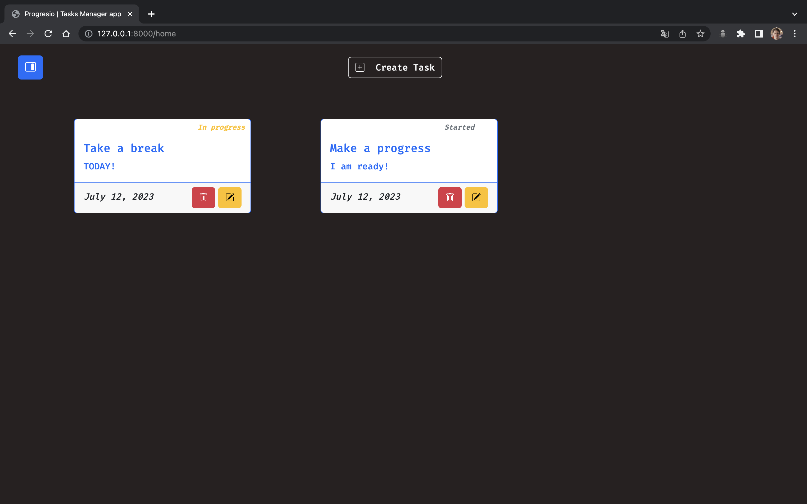

# Progresio ✅

Progresio is a web-based task management application. Currently, it allows you to create, edit, update, and delete tasks from the dashboard. Additionally, there is a calendar feature where all your tasks are displayed.

More features will be added in the near future, and eventually it will be available online. Progresio will always be open to listening to changes and proposals since its main objective is to learn Django, Git, and GitHub.

### Installation
***Important***: the installation process may vary slightly between operating systems. Here, it is done in MacOS/Linux. 

1. Open the terminal or command prompt on your computer.

2. Navigate to the directory where you want to clone the project. You can use the `cd` command followed by the directory path to navigate.

3. Once you are in the desired directory, execute the following command to clone the repository: 

   		git clone git@github.com:lucasarec/progresio.git

4.  After the cloning process is complete, navigate into the project directory using the `cd` command. 

5. Create a virtual environment for your project. This step is optional but recommended. You can use a tool like virtualenv to create the virtual environment.

6. Activate the virtual environment. The activation command will vary depending on the virtual environment tool you are using. For example, with virtualenv, you can use:
	
		source <virtualenv_name>/bin/activate

Replace <virtualenv_name> with the name of your virtual environment.

7. Create a file named '.env' to add the `SECRET_KEY`. You can do it from the console using the command `touch .env` .

8. After creating the '.env' file, you can write your `SECRET_KEY` using the following format:

		SECRET_KEY='your_secret_key_here'

Replace 'your_secret_key_here' with the actual secret key you want to use for your Django project.

9. Install the project dependencies. Use the following command to install the required packages specified in the project's `requirements.txt `  file:

		pip install -r requirements.txt

9. Once the dependencies are installed, you need to apply the migrations to set up the database. Run the following command:

		python3 manage.py migrate

10. Finally, you can start the Django development server by running the command:

		python3 manage.py runserver 

This will start the server, and you can access your Django project by opening a web browser and visiting http://localhost:8000 or the specified address shown in the terminal.

### Example and Showcase

 

